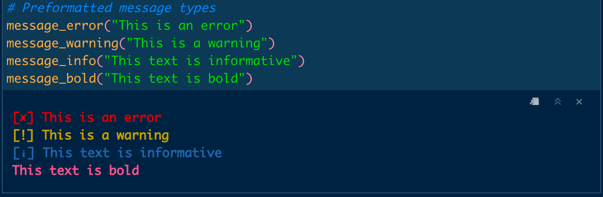

<!-- README.md is generated from README.Rmd. Please edit that file -->

```{r, include = FALSE}
knitr::opts_chunk$set(
  collapse = TRUE,
  comment = "#>",
  fig.path = "man/figures/README-",
  out.width = "100%"
)
```

# utilitybeltfmt

<!-- badges: start -->

[](https://lifecycle.r-lib.org/articles/stages.html#superseded)

<!-- badges: end -->

------------------------------------------------------------------------

**This package has been superseded by [fmt](https://github.com/selkamand/fmt)**

The goal of utilitybeltfmt is to colorise R console output with minimal effort. Preconfigured colorisations/symbol prefixes are provided for errors, warnings, and info messages.

## Installation

You can install the development version of utilitybeltfmt from [GitHub](https://github.com/selkamand/utilitybeltfmt) with:

``` r
# install.packages("devtools")
devtools::install_github("selkamand/utilitybeltfmt")
```

## Usage

### Preformatted messages

```{r example}
library(utilitybeltfmt)
```



### Formatting options

#### Format Strings

You can also **`fmt`**`type` functions to produce formatted (colorised) strings. These functions are useful for assertion messages.

```{r, eval = FALSE}

# Example assertion
if(condition == true){
  stop(fmterror("This is an error"))
}

# There are also options for warnings, info & bold text
message(fmterror("This is an error"))
message(fmtwarning("This is a warning"))
message(fmtinfo("This text is informative"))
message(fmtbold("This text is bold"))
```

#### Format Numbers

Convert to percentage with `fmtpercent` or scientific notation `fmtscientific`. Note these functions return characters (NOT numerics!).

```{r}
fmtpercent(97.8, decimal_places = 2)
fmtpercent(97.8, decimal_places = 0)
fmtpercent(0.12, decimal_places = 1, proportion = TRUE)

fmtscientific(0.0001)
```
