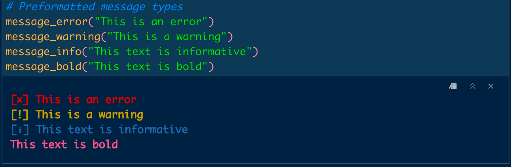

<!-- README.md is generated from README.Rmd. Please edit that file -->

# utilitybeltfmt

<!-- badges: start -->

[](https://lifecycle.r-lib.org/articles/stages.html#superseded)

<!-- badges: end -->

------------------------------------------------------------------------

**This package has been superseded by
[fmt](https://github.com/selkamand/fmt)**

The goal of utilitybeltfmt is to colorise R console output with minimal
effort. Preconfigured colorisations/symbol prefixes are provided for
errors, warnings, and info messages.

## Installation

You can install the development version of utilitybeltfmt from
[GitHub](https://github.com/selkamand/utilitybeltfmt) with:

``` r
# install.packages("devtools")
devtools::install_github("selkamand/utilitybeltfmt")
```

## Usage

### Preformatted messages

``` r
library(utilitybeltfmt)
```



### Formatting options

#### Format Strings

You can also **`fmt`**`type` functions to produce formatted (colorised)
strings. These functions are useful for assertion messages.

``` r

# Example assertion
if(condition == true){
  stop(fmterror("This is an error"))
}

# There are also options for warnings, info & bold text
message(fmterror("This is an error"))
message(fmtwarning("This is a warning"))
message(fmtinfo("This text is informative"))
message(fmtbold("This text is bold"))
```

#### Format Numbers

Convert to percentage with `fmtpercent` or scientific notation
`fmtscientific`. Note these functions return characters (NOT numerics!).

``` r
fmtpercent(97.8, decimal_places = 2)
#> Warning: `fmtpercent()` was deprecated in utilitybeltfmt 0.0.0.9000.
#> Please use `fmt::fmtpercent()` instead.
#> This warning is displayed once every 8 hours.
#> Call `lifecycle::last_lifecycle_warnings()` to see where this warning was generated.
#> [1] "97.80%"
fmtpercent(97.8, decimal_places = 0)
#> [1] "98%"
fmtpercent(0.12, decimal_places = 1, proportion = TRUE)
#> [1] "12.0%"

fmtscientific(0.0001)
#> Warning: `fmtscientific()` was deprecated in utilitybeltfmt 0.0.0.9000.
#> Please use `fmt::fmtscientific()` instead.
#> This warning is displayed once every 8 hours.
#> Call `lifecycle::last_lifecycle_warnings()` to see where this warning was generated.
#> [1] "1e-04"
```
